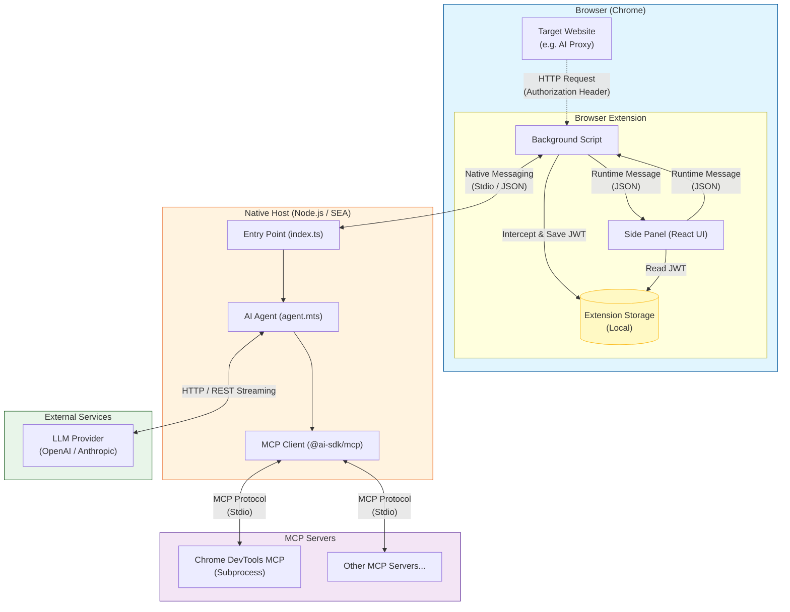
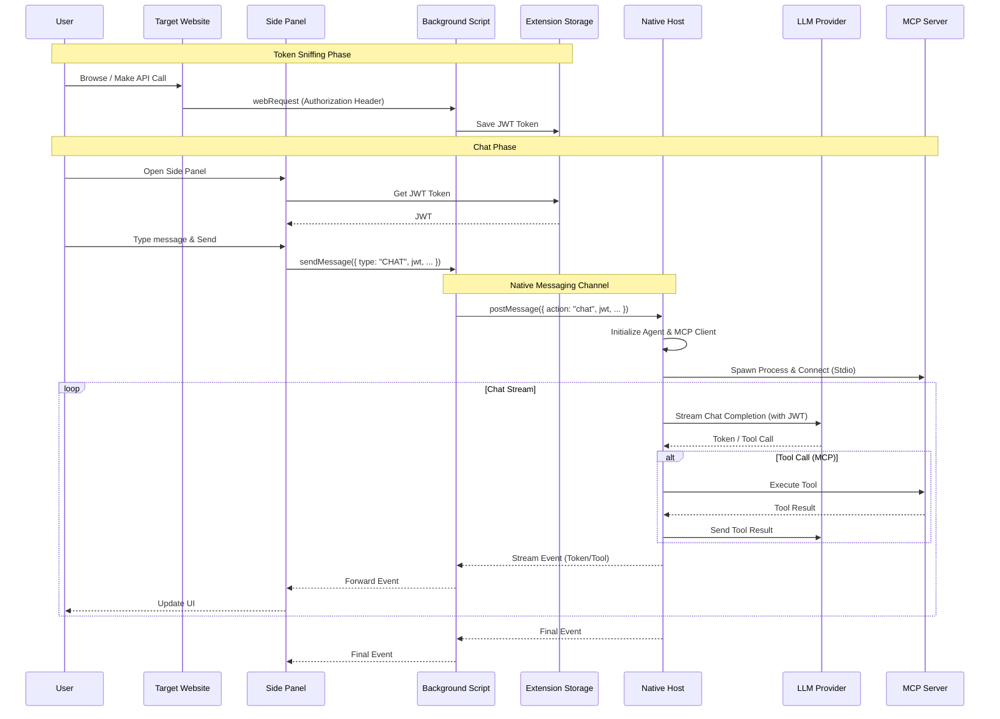

# Browser MCP Client

Chrome Extension の Native Messaging 機能を使用して、MCP Server と通信するクライアントです。
Chrome Extension のように、ブラウザ上の制約を受ける環境で MCP Server と通信するために設計されています。

このアプリケーションは特定環境（OpenAIやAnthropicのAPIのProxyを独自に提供しているような企業とかの環境）で使われることを想定しているため、自分の環境にいい感じに合わせて改変することを前提としています。

## 提供する機能

- ブラウザでアクセスしているページで使用している、Authorization Header を Chrome Extension 側から取得し、AI API Proxy へのリクエストに付与する機能
- MCP Server との通信
- MCP Server からのレスポンスをブラウザに返す機能

## 想定利用者

- 社内などで提供されている AI API Proxy を利用して MCP Server を利用したワークフローを利用したい人
- GitHub Copilot だったり、Gemini CLI みたいのを使ってない人

## アーキテクチャ図

### システム構成

### チャットフロー

